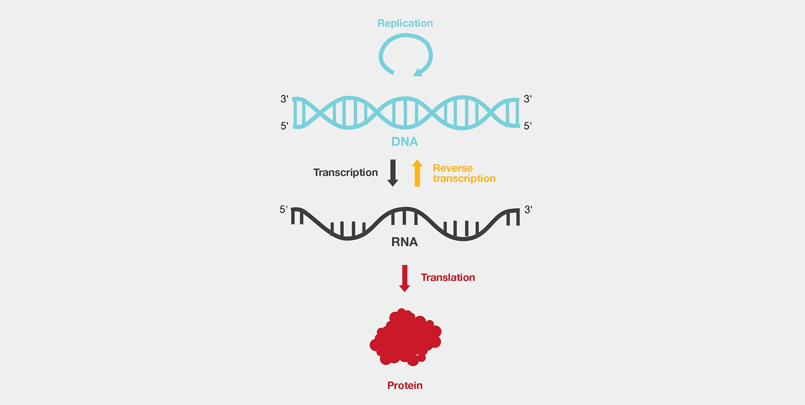
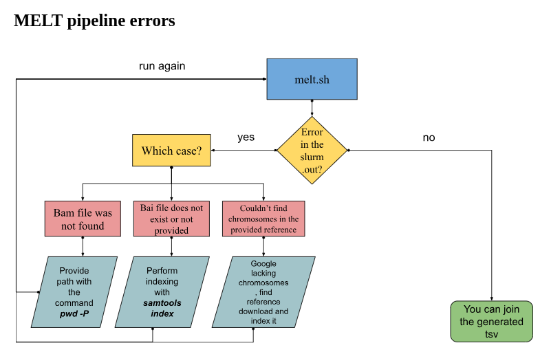
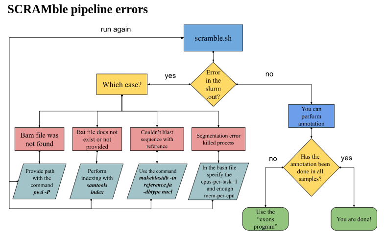
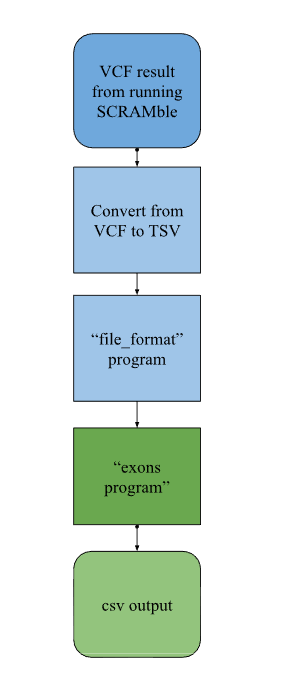
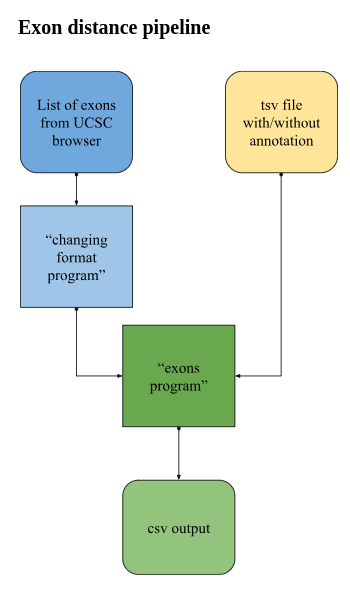

# Performance evaluation of bioinformatics tools for Transposable Element detection from NGS data

In this project, three Transposable Element Detection tools are compared using different sequencing datasets, such as, Whole Exome Sequencing (**WES**), Whole Genome Sequencing (**WGS**), RNA sequencing (**RNAseq**) and long-read sequencing. Transposable elements, sometimes referred to as mobile elements, are DNA sequences that have the ability to shift positions within the genome by using a retrotranscription mechanism, perhaps leading to mutations and changing the structure and function of the genome. 



Finding these components is essential to comprehending how they affect disease, evolution, and genetic variation. Our research makes use of both long-read and short-read sequencing data, using specific algorithms for each data type to offer thorough insights into the efficacy of various TE detection methods in a range of genomic scenarios. The data, analysis scripts, and supplemental resources utilized in our investigation are all contained in this repository.

## MELT/SCRAMble/mobster folders content:

The first we will find on each of these folders are the folders for each dataset that we ran with the corresponding tool. If you go inside each of them you will find the following programs in common:

* `copy_file.sh` program

These are personalized bash scripts designed to copy BAM and BAI files to your current directory from a shared directory. This makes sure you have locally all the files you need for your genetic research project.

To run it:

```
sbatch copy_file.sh
```

* `annotsv.sh` program

The script that is offered makes use of AnnotSV, a program that is used to annotate structural variants that are found in VCF files. AnnotSV provides thorough annotations for SVs, including details on genes, functional impact, population frequency, and more by integrating many annotation databases. The script already specifies the modules that are required. With the given parameters, genome build (GRCh37 or GRCh38), input VCF file, annotations directory, and output directory—it runs AnnotSV for each sample.

To run it:

```
sbatch annotsv.sh
```

The output TSV looks like this (this is only an example of the header and the first line of the **.annotated.tsv**):

```
> AnnotSV_ID	SV_chrom	SV_start	SV_end	SV_length	SV_type	Samples_ID	ID	REF	ALT	QUAL	FILTER	INFO	FORMAT	BQSR_S1	Annotation_mode	Gene_name	Gene_count	Tx	Tx_start	Tx_end	Overlapped_tx_length	Overlapped_CDS_length	Overlapped_CDS_percent	Frameshift	Exon_count	Location	Location2	Dist_nearest_SS	Nearest_SS_type	Intersect_start	Intersect_end	RE_gene	P_gain_phen	P_gain_hpo	P_gain_source	P_gain_coord	P_loss_phen	P_loss_hpo	P_loss_source	P_loss_coord	P_ins_phen	P_ins_hpo	P_ins_source	P_ins_coord	P_snvindel_nb	P_snvindel_phen	B_gain_source	B_gain_coord	B_loss_source	B_loss_coord	B_ins_source	B_ins_coord	B_inv_source	B_inv_coord	TAD_coordinate	ENCODE_experiment	GC_content_left	GC_content_right	Repeat_coord_left	Repeat_type_left	Repeat_coord_right	Repeat_type_right	Gap_left	Gap_right	SegDup_left	SegDup_right	ENCODE_blacklist_left	ENCODE_blacklist_characteristics_left	ENCODE_blacklist_right	ENCODE_blacklist_characteristics_right	ACMG	HI	TS	DDD_HI_percent	ExAC_delZ	ExAC_dupZ	ExAC_cnvZ	ExAC_synZ	ExAC_misZ	OMIM_ID	OMIM_phenotype	OMIM_inheritance	OMIM_morbid	OMIM_morbid_candidate	LOEUF_bin	GnomAD_pLI	ExAC_pLI	AnnotSV_ranking_score	AnnotSV_ranking_criteria	ACMG_class
> 1_149218125_149218126_ALU_1	1	149218125	149218126	278	ALU		.	A	<INS:ME:ALU>	.	ac0;s25	TSD=null;ASSESS=2;INTERNAL=null,null;SVTYPE=ALU;SVLEN=278;MEINFO=AluY,2,280,+;DIFF=0.1:c32t,c37g,c48g,g65a,a74g,c78g,g110a;LP=1;RP=3;RA=-1.585;PRIOR=false;SR=0	GT:GL:DP:AD	./.:-0,-0,-0:1:0	full		0																														1:147929336-149801433;1:148050779-149739249;1:148867551-149768855;1:149034709-149405578;1:149036512-149244464;1:149207860-149218152	0.0187;0.0100;0.0191;0.0800;0.0300;0.0509;TS	1:147929336-149801433;1:148050779-149739249;1:148867551-149768855;1:149034709-149405578;1:149036512-149278459;1:149036524-149256691;1:149145233-149244654;1:149202745-149436842;1:149207851-149218151;1:149207860-149218152	HI;0.1472;0.0900;0.2563;0.0100;0.0900;0.0213;0.0125;0.0900;0.3041;HI							0.420	0.420	1:149217924-149218060	PRIMA4-int	1:149217924-149218060	PRIMA4-int			1:149214788-149229035;1:149214788-149229035;1:149215313-149236883;1:149216600-149226886;1:149216600-149226886;1:149216600-149235129	1:149214788-149229035;1:149214788-149229035;1:149215313-149236883;1:149216600-149226886;1:149216600-149226886;1:149216600-149235129																								NA
```


* `elements.py` program

TSV files produced by the tool and the AnnotSV run are processed by this python script. It gathers pertinent data from many sources and merges it into a single CSV file. You can change the input file and the columns depending on your needs.

```
python3 elements.py
```

The output CSV file looks like this:

```
> Sample,Type,Info,Gene_name,Location,Filter,Start,End,Chromosome,Coverage,Genotype
>1,ALU,"0/1:-58,-14.45,-221.4:24:5",ACE,17_61565904_61565905_ALU_1,PASS,61565904,61565905,chr17,24,0/1
```

* `file_exist.sh` program

These programs are meant to check the existance of the specified files, just a way to validate if they are created correctly.

To run it:

```
sbatch file_exist.sh
```

* `indexing.sh` program

These files are intended to solve a major problem that came up during the MELT analysis procedure. For correct variant calling and efficient access, BAM files must be indexed by MELT. We index the BAM files using SAMtools in order to improve the efficiency and dependability of subsequent analyses.

To run it:

```
sbatch indexing.sh
```

And the ones that are not common between them:

### Only in MELT:

* `melt.sh` program

The script is a bash program that uses the MELT software to automatically find TEs in genomic sequencing data. Some parameters that must be specified or modified are: the type of mobile element to identify (**the options are in the script**), the path to the reference genome and the reference mobile elements, the directory holding the MELT software, and the location to the BED file defining genomic regions of interest. The script also loads necessary packages and their specific version.

To run it:

```
sbatch melt.sh
```

For each element we obtained a VCF file with the following information:

```
> CHROM	POS	ID	REF	ALT	QUAL	FILTER	INFO	FORMAT	BQSR_S1
> chr1	149218125	.	A	<INS:ME:ALU>	.	ac0;s25	TSD=null;ASSESS=2;INTERNAL=null,null;SVTYPE=ALU;SVLEN=278;MEINFO=AluY,2,280,+;DIFF=0.1:c32t,c37g,c48g,g65a,a74g,c78g,g110a;LP=1;RP=3;RA=-1.585;PRIOR=false;SR=0	GT:GL:DP:AD	./.:-0,-0,-0:1:0
```

Some errors that we found while trying to run the MELT tool and how to solve them:



* `join_vcf.sh` program

These are bash scripts that navigates to the directory for each identifier, which contains the MELT's result files. The final VCF files produced by MELT are copied into distinct files within each directory. Then it concatenates the  VCF files into a single file to afterwards perform the annotation.

To run it:

```
sbatch join_vcf.sh
```

### Only in SCRAMble:

* `scramble.sh` program

These scripts are designed to use the SCRAMble tool to analyze deletions and TEs in genomic sequencing data across a range of samples. Important  variables are defined upon loading the SCRAMble module, which include the directory containing the SCRAMble binaries, the file containing the consensus sequences of mobile element insertions, the reference genome file, and the location of the SCRAMble.R script. 
The cluster_identifier binary is run in order to create cluster files from input BAM files, a directory structure is created to hold the results, and a R script (SCRAMble.R) is called in order to assess MEIs and deletions based on the generated cluster files and reference resources. 

To run it:

```
sbatch scramble.sh
```

We obtained a VCF file with the following information:

```
> CHROM	POS	ID	REF	ALT	QUAL	FILTER	INFO
> chr16	81990619	INS:ME	A	<INS:ME:ALU>	52.9846420288086	PASS	MEINFO=chr16:81990619_ALU_Plus,81990619,81990620,+
```

Some errors that we found while trying to run the SCRAMble tool and how to solve them:



Now, as we mentioned in the paper, we had some troubles annotating the results of SCRAMble so now we will explain what we used in order to overcome this problem we followed the showed pipeline:



* `vcftotsv.sh` program

These bash scripts are made to convert VCF files to TSV files using the vcf2tsvpy utility. Based on the sample identifier, it specifies the directories for the intended output TSV file and the input VCF file for each iteration. 

To run it:

```
sbatch vcftotsv.sh
```

We obtained a TSV file with the following information:

```
> CHROM	POS	ID	REF	ALT	QUAL	FILTER	END	MEINFO	SVLEN	SVTYPE
> chr16	81990619	INS:ME	A	<INS:ME:ALU>	52.98	PASS	.	chr16:81990619_ALU_Plus,81990619,81990620,+	.	.
```

* `file_format.py` program

The function defined by this Python script takes each input TSV file that comes from the SCRAMble results and modifies it before writing the updated version to an output TSV file that has extra annotation fields. The function parses the tab-separated columns on each line of the input file as iterates through it. This enables us to obtain the relevant data and then utilize our exons distance program without relying on AnnotSV results.

To run it:

```
python3 file_format.py
```

We obtained a TSV file with the following information:

```
> CHROM	POS	ID	REF	ALT	QUAL	FILTER	END	MEINFO	SVLEN	SVTYPE	START	END
> chr16	81990619	INS:ME	A	<INS:ME:ALU>	52.98	PASS	81990620	chr16:81990619_ALU_Plus,81990619,81990620,+	.	.	81990619	81990620
```

This program is our first try to overcome the problem, that's why is not included in the pipeline:

* `partition.py` program

Using the line number from the source VCF file as an identifier, this Python software divides an input VCF file into separate VCF files. Each of these files has one structural variant entry. The header lines from the input file are kept, and each output file has the matching SV item appended to it. This was an attempt to try and lower the amount of information per file so that the annotation could be performed appropriately. We also tried to do it with by chromosome number, by strand, and by mobile element type. Nevertheless, the files were still too large to use AnnotSV, hence this strategy was unsuccessful.

### Only in mobster:

* `mobster.sh` program

The scripts are meant to run Mobster, which uses a probabilistic method to find MEIs and uses paired-end read properties to find insertions. It specifies the paths to the matching BAM file, sample output directory, and final results directory for every sample. The BAM input file, sample name, and output directory are among the parameters that the script uses to run Mobster. Java is necessary for Mobster to function, and the -Xmx8G parameter specifies an 8GB memory allocation. It also uses a settings file (Mobster.properties) to set its parameters and behavior based on whether Hg19 (the default) or Hg38 is being used. 

To run it:

```
sbatch mobster.sh
```

We obtained a TXT file with the following information:

```
> Chr	Mobile Element	Insert Point	border5	border3	merged	sample	sample_counts	cluster5 length	cluster3 length	cluster5 hits	cluster3 hits	split5 hits	split3 hits	polyA5 hits	polyT5 hits	polyA3 hits	polyT3 hits	original discordant unique	original multiple	original unmapped	leftclipped max dist	rightclipped max dist	leftclipped same pos	rightclipped same pos	clipped avg qual	clipped avg length	target site duplication
> chr1	ALU	1647758	1647742	1647775	false	/scratch/lab_genresearch/ahirata/ahirata/mobster_results/BQSR/BQSR_S1/Results/Sample_S1	/scratch/lab_genresearch/ahirata/ahirata/mobster_results/BQSR/BQSR_S1/Results/Sample_S1=20	53	145	1	19	0	0	0	0	0	0	0	20	0	-1	-1	-1	-1	-1	-1	unknown
```

* `convert_vcf.sh` program

These scripts use a Java JAR file named MobsterVCF to convert Mobster predictions from text format to VCF format. The Mobster predictions may now be more easily analyzed and visualized later on thanks to this technique. It specifies the locations of the matching output VCF files and the input text files that include Mobster predictions. It converts the Mobster predictions to VCF format by running the Java command with the given JAR file and input/output file directories during each iteration.

To run it:

```
sbatch convert_vcf.sh
```

We obtained a VCF file with the following information:

```
> CHROM	POS	ID	REF	ALT	QUAL	FILTER	INFO
> chr1	1647759	.	.	<INS:ME:ALU>	.	PASS	IMPRECISE;SAMPS=/scratch/lab_genresearch/ahirata/ahirata/mobster_results/BQSR/BQSR_S1/Results/Sample_S1:20;CIPOS=1647742,1647775;SUP=1,19,0,0;POLYA=0;TSD=unknown;CLLEN=53,145;ORIGIN=0,20,0;CLIPPED=-1,-1,-1,-1,-1.00,-1.00
```

## long_reads folder content:

The programs used in this folder are already mentioned previously, but one program is meant only the long read detection.

* `rMETL.sh` program

The script runs the rMETL tool. The rMETL module is loaded first, and the rmetl environment is turned on. The reference genome, input BAM file, output directory, and temporary directory for intermediate files are among the important variables that are defined next.
It uses the reference genome and the input BAM file to identify possible MEIs while it carries out the detection command. After the MEIs are found, they are realigned using the realignment command with a reference file that contains sequences of known mobile elements. By taking sequence variations into account, this phase improves the accuracy of MEI identification.
Lastly, uses the calling command to perform MEI calling, producing a VCF file with the discovered MEIs. 

To run it:

```
sbatch rmetl.sh
```

We obtained a VCF file with the following information:

```
> CHROM	POS	ID	REF	ALT	QUAL	FILTER	INFO	FORMAT	None
> chr1	12798634	0	A	<INS:ME:Alu>	.	PASS	PRECISE;SVTYPE=INS;SVLEN=325;END=12798958;SAMPLE=None;STRAND=+	GT:DV:DR	1/1:7:1
```

## exons content:

* `format.py` program

The script works by parsing a file that contains the exons from the defined reference genome from the UCSC browser, reformatting the exon information, and writing it to a new file.
The script divides the input file's lines into tab-delimited columns by iterating over each line. After being retrieved, the exon start and end positions are converted to integers and empty values are filtered out. Furthermore, the gene symbol is obtained. The script creates a new line for each exon entry that has the original columns, the exon identifier, the gene symbol, and the reformatted exon start and end positions. This is done in order to preserve the data for every exon that encodes a single gene.

From:

```
> hg19.knownGene.name	hg19.knownGene.chrom	hg19.knownGene.strand	hg19.knownGene.txStart	hg19.knownGene.txEnd	hg19.knownGene.cdsStart	hg19.knownGene.cdsEnd	hg19.knownGene.exonCount	hg19.knownGene.exonStarts	hg19.knownGene.exonEnds	hg19.knownGene.proteinID	hg19.kgXref.geneSymbol
> uc001aaa.3	chr1	+	11873	14409	11873	11873	3	11873,12612,13220,	12227,12721,14409,		DDX11L1
```

To:

```
> hg19.knownGene.name	hg19.knownGene.chrom	hg19.knownGene.strand	hg19.knownGene.txStart	hg19.knownGene.txEnd	hg19.knownGene.cdsStart	hg19.knownGene.cdsEnd	hg19.knownGene.exonCount	hg19.knownGene.exonStarts	hg19.knownGene.exonEnds	hg19.knownGene.proteinID	hg19.kgXref.geneSymbol
> uc001aaa.3	chr1	+	11873	14409	11873	11873	3	11873	12227	DDX11L1	exon 1
> uc001aaa.3	chr1	+	11873	14409	11873	11873	3	12612	12721	DDX11L1	exon 2
> uc001aaa.3	chr1	+	11873	14409	11873	11873	3	13220	14409	DDX11L1	exon 3
```

To run it:

```
python3 format.py
```

* `distance.py` program

The Python script, by using genomic coordinates, processes a set of MEIs and calculates how close they are to exons. The file paths for the output CSV file (output_file), the ME insertions file (MEs_file), and the exon list (exons_file) are defined first.
Next, line by line, the script reads the exon list file, parses each line into a column, and extracts pertinent data. It adds this data, arranged by chromosomal, to the exons dictionary.
There are two defined assistance functions: near_exon() finds the nearest exon to a given mobile element insertion based on distance, and distance() computes the distance between a location and an exon boundary.
The output CSV file is opened for writing to start the main processing loop. Column names are written in a header row that is written.
The ME insertions file is then opened, and each row is iterated over. It retrieves data for every ME insertion. Next, it determines whether the ME insertion chromosome is included in the exons lexicon. If so, it locates the closest exon and determines its distance using the near_exon() function. 
Lastly, it adds pertinent data for additional analysis to the final CSV file. 



To run it:

```
python3 distance.py
```

An example of the output CSV file:

```
>Sample,Chromosome,ME_Start,ME_End,Distance_to_Exon,Distance_Tag,Gene,Gene_AnnotSV,Exon_Number,Coverage,Genotype
> 1,chr17,61565904,61565905,25,Close,ACE,ACE,exon 5,24,0/1
> 1,chr17,61565904,61565905,25,Close,ACE,ACE,exon 5,24,0/1
```

* `distance_no_annotsv.py` program

Works the same way as the one with the annotations of AnnotSV but this time it does not need them, these for the SCRAMble results. Also can be took as a reference of how to incluide or not include information in the distance program.

## genes content:

* `format.py` program

As we wanted to perform the comparisons of the candidate genes with the ones annotated we wanted them to be in a format to make the comparisons, a list, so we used this program to store in a list the candidate genes.

To run it:

```
python3 format.py
```

* `genes.py` program

The script creates a CSV file that includes pertinent data and a gene-name mapping. It begins by defining lists of genes linked to various immunological illnesses.
It reads the matching CSV file from each tool iteration—in our case, from our exon distance program. It extracts data and determines whether the gene name is one of the genes linked to immunological illnesses for every line in the CSV file. If so, it adds pertinent details to the dictionary under the appropriate person's name.
Lastly, it saves the gathered data to a CSV file, where each row includes information about a person's gene occurrence, including the chromosome and the instrument employed.

To run it:

```
python3 genes.py
```

An example of the output CSV file:

```
> Individual,Gene_name,Distance,Distance_tag,Exon,Tool,Chromosome
> 1,PLCG2,135,Near,exon 32,scramble,chr16
> 10,PLCG2,135,Near,exon 32,scramble,chr16
```

* `ME_per_data.py` program

In order to plot the amount of mobile elements per dataset we used to program to determine that information.

To run it:

```
python3 ME_per_data.py
```

## de_novo content:

* `de_novo.py` program

This Python program finds de novo mutations by analyzing gene expression data. It generates a CSV file with the identified de novo mutations after reading data from an input CSV file that contains gene expression data.
To find de novo mutations, the check_gene_expression function analyzes the input data. Iteratively going through the data, it finds entire families (those whose samples have the labels 'i','m', and 'f' for individual, mother, and father, respectively). Next, it contrasts an individual's gene expression with that of their parents. A de novo mutation occurs when a gene expresses itself in the individual but not in either parent.

To run it:

```
python3 de_novo.py
```

An example of the output CSV file:

```

```

* `VH_format.py` program

This program was meant to add a new column to the WES Vall d'Hebron, vice versa, in order to termine the tag from one to each other to perform the comparisons WES-WGS.

## Data_visualization content:

* `Final_results.Rmd` program

Contains all the commands used in R to obtain all the graphical visualizations observed in our project.
